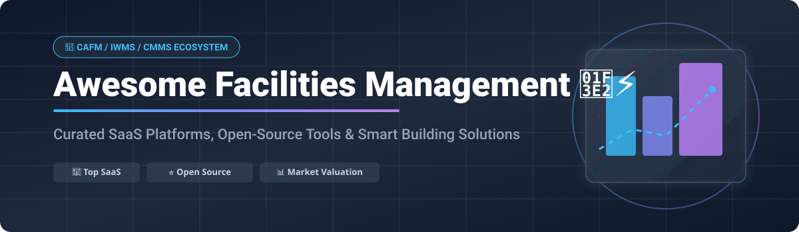
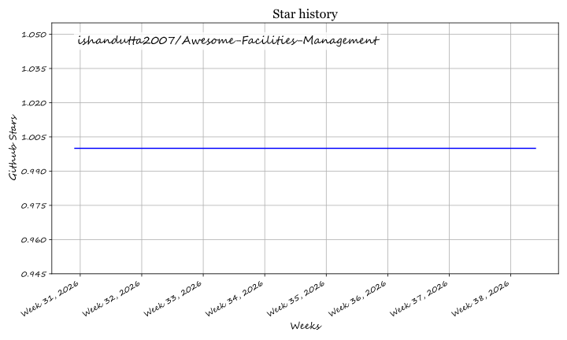

# Awesome-Facilities-Management

  

  

## 🚀 Similar Projects to Facilities Management & CMMS Platforms

Welcome to the curated directory of **Computerized Maintenance Management Systems (CMMS)**, **Enterprise Asset Management (EAM)**, and **Facilities Management (FM)** platforms. This resource is designed to help facilities managers, maintenance directors, and IT teams compare commercial SaaS platforms with leading open-source alternatives.

### 🔑 Key Facility & Maintenance Management Features
- 📋 **Work Order Management** — Dispatch, schedule, and track corrective maintenance tasks.
- ⚙️ **Preventive Maintenance (PM)** — Create recurring calendar or meter-based maintenance schedules.
- 📦 **Asset Lifecycle & Inventory Tracking** — Manage spare parts, asset history, and barcode scans.
- 🏢 **Space & Workplace Planning** — Optimize desk assignments, floor plans, and occupancy.
- 📊 **Analytics & Reporting** — Track Mean Time to Repair (MTTR) and maintenance costs.

Below is a curated list of notable commercial systems and their open-source counterparts, structured for quick evaluation.

## 🏢 SaaS / Hosted Platforms

| Platform | Description | Pricing | Free Tier & Limits | Company Size (Revenue/Valuation) |
| :--- | :--- | :--- | :--- | :--- |
| **[IBM Maximo](https://www.ibm.com/products/maximo)** | Enterprise-grade Asset Management and CMMS solution. | Custom / Quote-based (typically starts at $40,000+/year via AppPoints) | No free tier (14-day free trial available) | **Enterprise Leader** (Parent IBM Revenue: ~$62B/year) |
| **[MaintainX](https://www.getmaintainx.com/)** | Modern, user-friendly CMMS focused on work orders and team collaboration. | Paid plans start at $10/user/month | **Free plan available** (max 2 active repeating work orders, 2 work orders with procedures, 1-month history limit) | **$2.5B Valuation** (Estimated Revenue: ~$115M/year) |
| **[Archibus](https://archibus.com/)** | Integrated Workplace Management System (IWMS) and facilities management platform. | Custom / Quote-based | No free tier | **$600M Valuation** (Estimated Revenue: ~$200M/year) |
| **[Limble CMMS](https://www.limblecmms.com/)** | Easy-to-use CMMS with strong preventive maintenance and asset tracking features. | Custom / Quote-based | No free tier (free trial, unlimited free requesters) | **$450M Valuation** (Estimated Revenue: ~$20M/year) |
| **[Fiix](https://www.fiixsoftware.com/)** (Rockwell Automation) | CMMS with strong asset performance and analytics capabilities. | Paid plans start at $45/user/month | **Free plan available** (max 3 users, 25 preventive maintenance tasks, no inventory management) | **Acquired** (Parent Rockwell Revenue: ~$8B/year) |
| **[OfficeSpace](https://www.officespacesoftware.com/)** | Space management and workplace experience platform. | Custom / Quote-based | No free tier | **Estimated Revenue: ~$30.9M/year** (owned by Eptura) |
| **[FMX](https://www.gofmx.com/)** | Facilities management software popular in education and multi-site organizations. | Custom / Quote-based | No free tier | **Estimated Revenue: ~$30.9M/year** |
| **[UpKeep](https://www.upkeep.com/)** | Popular mobile-first CMMS for work orders, asset management, and preventive maintenance. | Starts at $20–$24/user/month | No free tier (7-day free trial, unlimited free requesters) | **Estimated Revenue: ~$22.4M/year** (Valuation ~$100M+) |
| **[eMaint](https://www.emaint.com/)** (Fluke) | Established CMMS/EAM platform. | Starts at ~$69/user/month (3-user minimum) | No free tier | **Estimated Revenue: ~$15.6M/year** (owned by Fluke/Fortive) |
| **[Hippo CMMS](https://www.hippocmms.com/)** | Straightforward CMMS for maintenance teams. | Starts at ~$35/user/month | No free tier (free trial available) | **Estimated Revenue: ~$3.1M/year** (acquired by Eptura) |

## 🔓 Open-Source Software

- **[Odoo](https://github.com/odoo/odoo)** (Maintenance / MRP modules)  — Open-source ERP with dedicated maintenance management capabilities. Can handle work orders, equipment, preventive maintenance schedules, and integrate with inventory and accounting.
- **[ERPNext](https://github.com/frappe/erpnext)**  — Open-source ERP that includes asset management and maintenance features suitable for facilities and plant maintenance.
- **[Snipe-IT](https://github.com/snipe/snipe-it)**  — Excellent open-source IT asset management system. Useful for tracking equipment, licenses, and consumables (pairs well with a full CMMS).
- **[GLPI](https://github.com/glpi-project/glpi)**  — Primarily an IT Service Management and asset management tool, but frequently adapted for broader equipment and facilities tracking.
- **[openMAINT](https://www.openmaint.org/)**  — The leading open-source CMMS and facilities management application. Built on the CMDBuild framework, it supports asset and building management, preventive and corrective maintenance, work orders, inventory, documents, and space-related processes. Excellent for facility and property maintenance teams.
- **[CalemEAM](https://github.com/calemeam)**  — Open-source Enterprise Asset Management (EAM) / CMMS system. Provides asset tracking, work orders, preventive maintenance, and multi-site support.
- CMDBuild (the framework behind openMAINT) — Highly configurable open-source environment for building custom asset and maintenance management applications.
- **SuperCMMS / Atlas CMMS-style projects** — Community and commercial-open-source CMMS solutions focused on work orders, assets, and preventive maintenance (check current GitHub activity for the most maintained forks).

### 🛠️ Typical Open-Source Stack
1. 🏢 **Core CMMS / Facilities** — openMAINT or CalemEAM
2. ⚙️ **ERP + Maintenance** — Odoo or ERPNext (when broader business processes are needed)
3. 📦 **Asset registry** — Snipe-IT or the asset modules in the tools above
4. 📱 **Mobile / field use** — Progressive web apps or community mobile clients
5. 📊 **Reporting & IoT** — Custom dashboards + optional sensor integrations

These solutions provide full control over maintenance data, no per-user licensing fees, and the ability to tailor workflows to exact facility or industrial requirements.

---

**🤝 How to contribute**  
Fork this repository, add a new project (with link + short description + category), and open a pull request.  
Prefer actively maintained open-source projects related to CMMS, facilities management, enterprise asset management (EAM), or maintenance work-order systems.

##  Star History

<a href="https://www.star-history.com/?repos=ishandutta2007%2FAwesome-Facilities-Management&type=date&legend=bottom-right">
<picture>
<source media="(prefers-color-scheme: dark)" srcset="https://api.star-history.com/chart?repos=ishandutta2007/Awesome-Facilities-Management&type=date&theme=dark&legend=bottom-right" />
<source media="(prefers-color-scheme: light)" srcset="https://api.star-history.com/chart?repos=ishandutta2007/Awesome-Facilities-Management&type=date&legend=bottom-right" />

</picture>
</a>

**📄 License**  
This list is public domain / CC0. Feel free to copy into your own awesome list or README.

Star the projects you find useful — open maintenance tools help teams keep facilities running without proprietary lock-in! 🛠️
# Awesome-Facilities-Management

## Top Genomics Data Platforms Ecosystem

**Curated List of SaaS Products & Open-Source GitHub Projects**

*Focused on Genomic Analysis Workspaces, Workflow Orchestration, Multi-Omics Data & Collaborative Bioinformatics*

**Last updated: September 2026**

This repository tracks notable **SaaS platforms** and **open-source projects** for **Genomics Data Platforms**. These systems provide secure workspaces, workflow engines, data management, and collaboration tools for large-scale genomic and multi-omics analysis in research and clinical settings.

**Examples** include DNAnexus, Seven Bridges (Velsera), Illumina Connected Analytics, Terra (Broad Institute), BaseSpace Sequence Hub, Seqera, Genialis, Fabric Genomics, SOPHiA GENETICS, and PrecisionFDA (the category leaders).

**Open-source emphasis**: Genomics has excellent open platforms. **Galaxy**, **Cromwell/WDL**, **Nextflow**, and Terra’s open components power a large share of academic and consortium-scale analysis. This section is heavily expanded.

Contributions welcome! Open a PR to add/update entries. Keep descriptions factual and link to official sites.

## Table of Contents

- [SaaS/Hosted Platforms](#saas-products)

- [Open-Source GitHub Projects](#open-source-github-projects)

- [How to Contribute](#how-to-contribute)

- [Disclaimer](#disclaimer)

## SaaS/Hosted Platforms

- **[DNAnexus](https://www.dnanexus.com/)**  

  Enterprise precision-health data platform for governed genomic data, workflows, notebooks, and cohort analysis with strong compliance posture.

- **[Seven Bridges / Velsera](https://www.sevenbridges.com/)**  

  Bioinformatics platform with deep oncology and multi-omics capabilities, CWL support, and major public-cloud research deployments (e.g., Cancer Genomics Cloud).

- **[Illumina Connected Analytics](https://www.illumina.com/)**  

  Illumina’s cloud analytics environment for secondary analysis, data management, and integration with sequencing workflows.

- **[Terra (Broad Institute)](https://terra.bio/)**  

  Cloud-native biomedical analysis platform co-developed by Broad, Verily, and Microsoft—widely used for WDL/GATK workflows, notebooks, and large consortia (pay for cloud resources).

- **[BaseSpace Sequence Hub](https://www.illumina.com/)**  

  Illumina’s sequencing data management and analysis hub for instrument output, apps, and collaboration.

- **[Seqera Platform](https://seqera.io/)**  

  Nextflow-centric orchestration and control plane for running pipelines across cloud, hybrid, and HPC environments.

- **[Genialis](https://www.genialis.com/)**  

  Biomedical data analysis platform focused on RNA-seq and multi-omics interpretation for research and translational use.

- **[Fabric Genomics](https://fabricgenomics.com/)**  

  Clinical genomic interpretation and analysis platform used in diagnostic and precision-medicine settings.

- **[SOPHiA GENETICS](https://www.sophiagenetics.com/)**  

  Data-driven medicine platform combining genomic analysis, AI, and clinical reporting for healthcare institutions.

- **[PrecisionFDA](https://precision.fda.gov/)**  

  FDA’s collaborative platform for evaluating bioinformatics pipelines and advancing regulatory science in genomics.

## Open-Source GitHub Projects

- **[Galaxy](https://github.com/galaxyproject/galaxy)**  

  Leading open-source, web-based platform for accessible, reproducible biomedical data analysis—thousands of tools, workflows, and a global training community.

- **[Cromwell](https://github.com/broadinstitute/cromwell)**  

  Open-source workflow engine for WDL (Workflow Description Language), designed for simplicity and scalability from laptop to cloud (core of Terra execution).

- **[Nextflow](https://github.com/nextflow-io/nextflow)**  

  Open-source workflow system for scalable and reproducible scientific pipelines, with strong cloud and container support (foundation of Seqera Platform).

- **[WARP (Broad Institute pipelines)](https://github.com/broadinstitute/warp)**  

  Open, production-grade, cloud-optimized WDL pipelines for large-scale genomics consortia, tuned for Terra and Cromwell.

- **[Snakemake](https://github.com/snakemake/snakemake)**  

  Open-source workflow management system widely used in bioinformatics for scalable, reproducible pipelines.

- **[nf-core](https://github.com/nf-core)**  

  Community collection of high-quality, curated Nextflow pipelines for genomics and multi-omics analysis.

- **[Dockstore](https://github.com/dockstore/dockstore)**  

  Open platform for sharing Docker-based tools and workflows (WDL, CWL, Nextflow) used across Terra, Galaxy, and other systems.

- **[GA4GH standards and tool registries](https://github.com/ga4gh)**  

  Open standards and reference implementations for genomic data sharing, workflows, and tool discovery.

- **[Bioconductor / open R genomics stacks](https://github.com/Bioconductor)**  

  Open R packages and infrastructure for statistical analysis of genomic data, often run inside Terra or Galaxy environments.

- **[Open notebook and analysis environments](https://github.com/)**  

  Jupyter, RStudio, and related open tools commonly deployed within genomics data platforms.

### Additional Strong Open-Source Options

- Running **Galaxy** (public servers or self-hosted) for accessible, tool-rich analysis.

- Using **Cromwell + WDL** or **Nextflow + nf-core** for scalable, reproducible pipelines on any cloud or HPC.

- Leveraging **Terra** as a managed front-end while keeping workflows and pipelines open.

- Combining open workflow engines with commercial data platforms for compliance-sensitive workloads.

- Accepting that validated clinical pipelines, multi-cloud governed data environments, and enterprise support still favor commercial platforms (DNAnexus, Seven Bridges, Illumina, SOPHiA, Fabric, etc.).

- Focusing open-source efforts on reproducibility, portability, and community-curated pipelines.

**Frameworks for building custom systems**: Write pipelines in WDL (Cromwell) or Nextflow → register in Dockstore → execute on Terra, self-hosted Cromwell/Nextflow, or Galaxy → analyze results in open notebooks or Bioconductor → share via GA4GH-compatible APIs. Suitable for academic, consortium, and many industry research teams. Clinical and highly regulated environments often layer commercial platforms on top of open methods.

## How to Contribute

1. Fork the repo.

2. Add/edit entries in `README.md` (follow existing format).

3. Include: name, link, 1–2 sentence description, and whether it's SaaS or open-source.

4. Submit PR with a short explanation.

Star the repo if you find it useful!

## Disclaimer

- This is a **community-curated** list — not exhaustive and not an endorsement.

- Genomics data platforms handle highly sensitive human genetic data. Compliance (HIPAA, GDPR, clinical validation) and security are critical. Open-source tools require careful deployment and governance. This list is not clinical, regulatory, or legal advice.

---

**Made for bioinformaticians, genomic researchers, and precision-medicine teams.**

Let's keep genomic analysis reproducible, portable, and as open as practical.

## ⭐ Star History

<a href="https://star-history.com/#ishandutta2007/Awesome-Facilities-Management&Timeline" align="center">
  <picture>
    <source media="(prefers-color-scheme: dark)" srcset="assets/ishandutta2007_Awesome-Facilities-Management_growth.svg">
    
  </picture>
</a>
